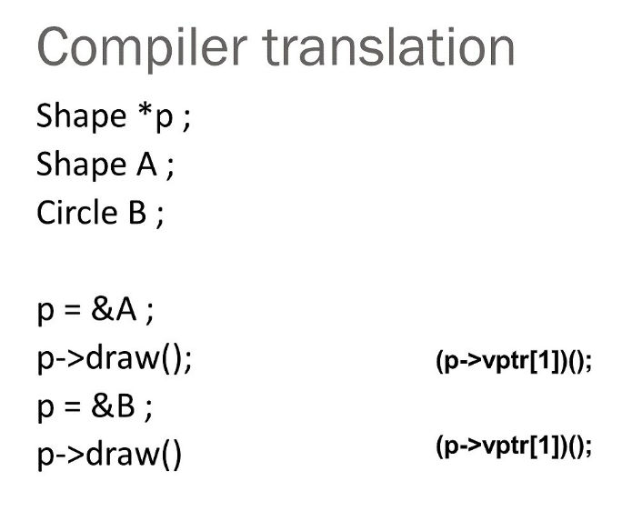

## 多型
### 定義
**多型就是當你用基底 class 的指標或參照來進行處理時，卻可以依照其 subclass 來進行不一樣的事情**
### virtual function
- 任何想要被繼承的 class overriden 的 method 都要宣告成 virtual
- 一個 func 一旦宣告成virtual，則在繼承的 class 也是 virtual，可以忽略不寫，不過建議要寫
- 多型只對 pointer, reference, 以及宣告為virtual 的 func 有效
- 如果一個　class 有任何一個method 被宣告成virtual，則destructor也應該宣告成 virtual，確保 destructor有做正確的清除
### 多型與 overloading 的差別
- overloading 是 static time，多型是 dynamic time，也就是一個是在 compile time就知道，一個是在 runtime才知道
```cpp
// overloading example
class Calculator {
public:
    int add(int a, int b) { return a + b; }
    double add(double a, double b) { return a + b; }
};
```
```cpp
// 多型 example
class Animal {
public:
    virtual void speak() { cout << "Sound\n"; }
};

class Cat : public Animal {
public:
    void speak() override { cout << "Meow\n"; }
};
```
### 多型下的 Compiler 到底在幹嘛
 
其實 compiler 硬體層級根本不需要知道甚麼多型，他只需要遵守著 vtable 裡指著哪個位置去執行