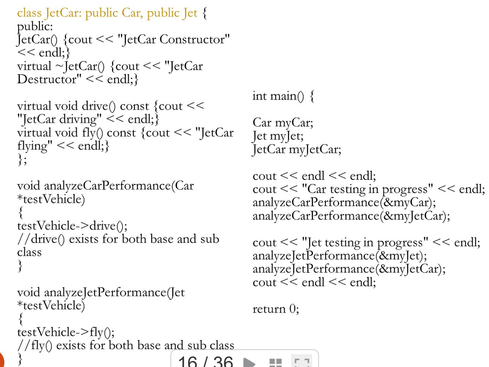

## UpCasting
- 多型的基礎
```cpp
Cat* myCat = new Cat();
Pet* myPet = myCat; // 這就是 Upcasting，自動轉型
myPet->speak();     // OK (多型)
// myPet->catchMouse(); // error, Pet 標籤沒這個功能
```
## DownCasting
想像一個場景，有基底類別 vihecle，有一個繼承他的子類別 Car，又有一個繼承 Car 的子類別 JetCar，假設現在想搞多型 Car* jetc = new JetCar()，然後你想走 JetCar 的特殊方法 fly()，此時會報錯，jetc 的 static type 就是 Car，他的 Dynamic type 要到 run time才會知道是 JetCar，所以你只能在 runtime 的時候向下猜，C++ 有 dynamic_cast 去判斷
```cpp
Pet* somePet = new Cat(); // 目前標籤是 Pet

// 我猜它是貓，想用貓的功能
Cat* realCat = dynamic_cast<Cat*>(somePet); 

if (realCat) { // 如果轉型成功（它真的是貓）
    realCat->catchMouse(); // 成功找回貓的功能
} else {
    // 轉型失敗（它可能是狗或別的），realCat 會是 nullptr
}
```
但這種方法很糟糕，原因如下
1. 他是RTTI (Run Time Type Information)，看到 run time 就知道很慢了
2. 維護惡夢，每多一個特殊物件就要 is else 一次，完全違背OOP精神
### 解法? 用多重繼承
再創建一個 `Jet: Public Vehicle`，讓 jetc 同時繼承 Car 跟 Jet

但使用多重繼承時，就會有 ambiguity，C++有很多種解法
### Solution 1 - casting ambiguous attributes or method
```cpp
class task {
    //...
    virtual debug_inf* get_debug();
}

class displayed {
    //...
    virtual debug_inf* get_debug();
}

class satellite: public task, public displayed {
    //....
}

void print_debug(satellite* sp) {
    debug_inf* dip = sp -> get_debug(); // wrong, ambiguity
    debug_inf* dip = sp -> task:: get_debug(); // good
}
```
但這只能解決基本問題，如果遇到像 jetc 多重繼承兩個父親，他們父親又都是同個阿公，就會造成鑽石型繼承，子類別會有兩份阿公類別的資料，這樣是不合理的，所以要用虛擬繼承 (public virtual)，透過在繼承清單加上 virtual 關鍵字，我們強迫 Car 和 Jet 共享同一個 Vehicle 基底。這樣一來，當 JetCar 多重繼承這兩者時，就不會產生冗餘的資料備份，也解決了鑽石繼承中的 ambiguity。