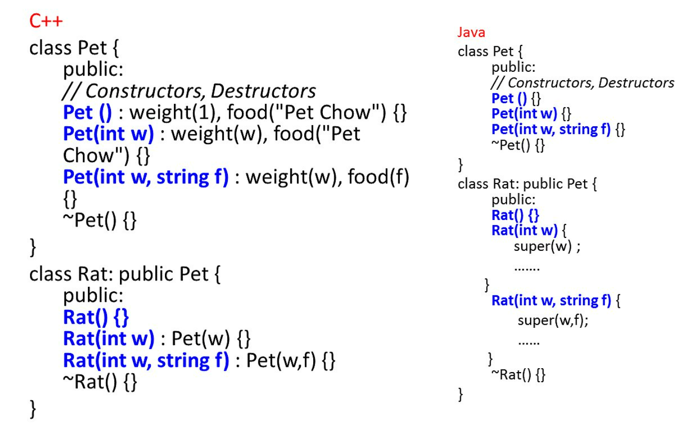

## C++ V.S. JAVA
### 傳參數到 base class

### Array
```cpp
class Pet {
};

Pet allpets[100]; // declare 100 objects memory space is allocated
```
```java
class Pet {
};

Pet allpets[100]; // 會失敗

for (i=0; i<100; i++) {
    apppets[i] = new Pet() // 這樣才成功
}
```
### 參數傳遞的方法
**C++**

for primitive type(int, char, etc.,) or calss type, they can be passed by
- pass by value
- pass by address
- pass by reference

**java**

primitive types only pass by value
class type only pass by reference

### Object allocation
**C++**
- Global variable (int data segment)
- Local variable (in stack)
- Heap variable

**Java**
- Global variable: can be approximated via static inside a class
- Local variable (for primitive type only)
- Heap variable (for any class types or primitive types)